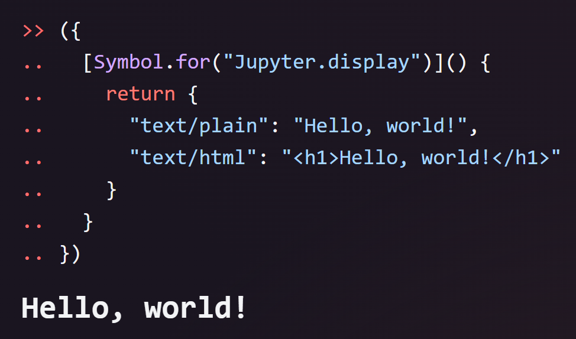
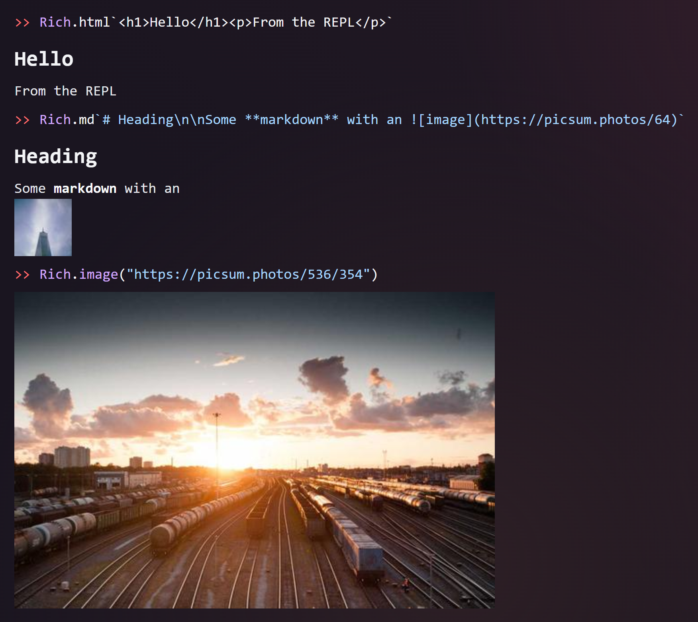
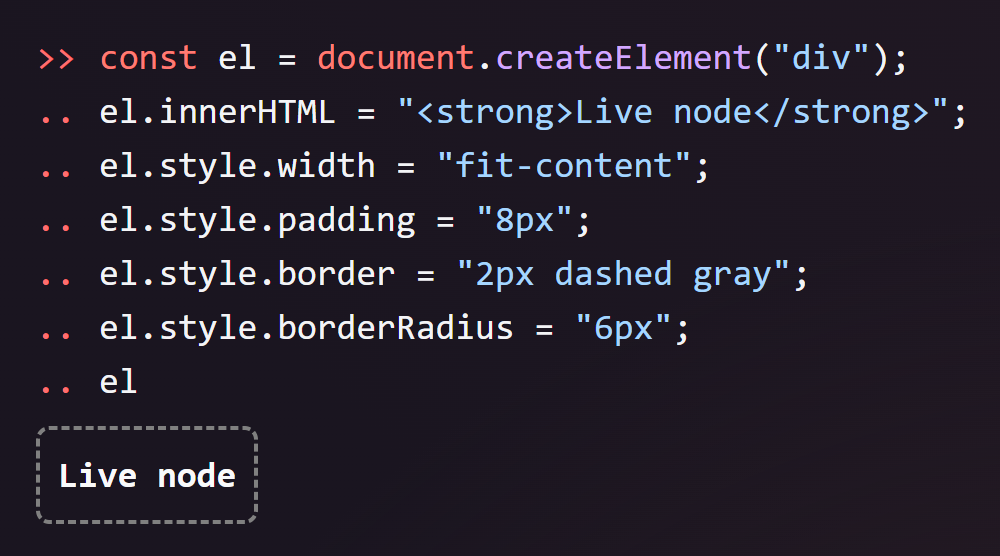
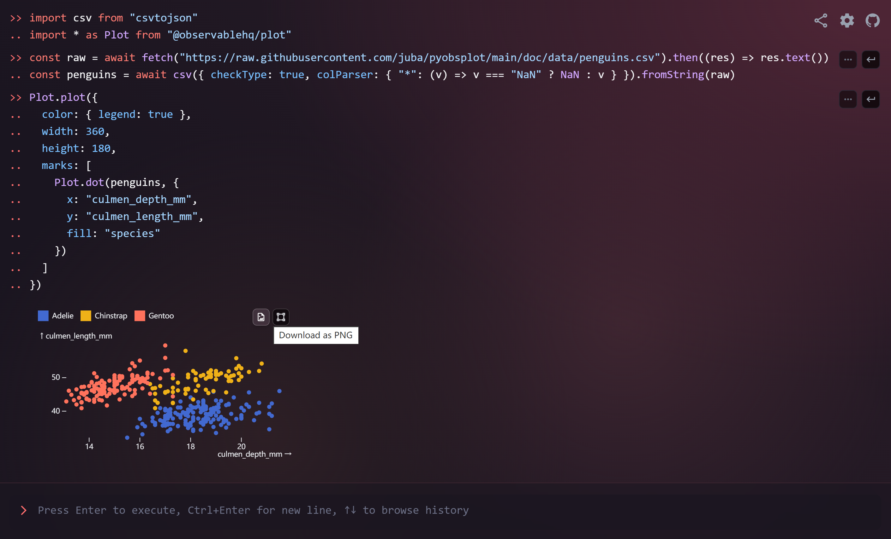
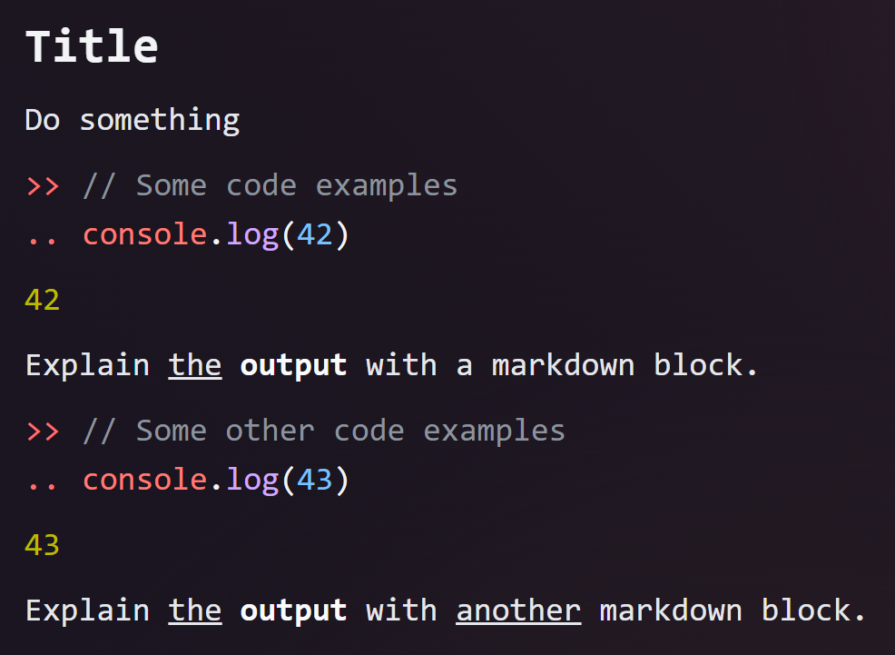

<h1 align="center">JS/TS REPL</h1>

<p align="center">
  An online <strong>REPL</strong> for <strong>JavaScript/TypeScript</strong>.
</p>


## Features

- **Interactively** execute <del>any</del> [almost any](#limitations) JavaScript/TypeScript code directly in your browser.
- _(Type annotations are stripped before execution, and no type checking is performed.)_
- Beautiful output with **syntax highlighting** (powered by [highlight.js](https://github.com/highlightjs/highlight.js)) and **pretty-printing** (enabled by [showify](https://github.com/Snowflyt/showify)).
- **Import any NPM package** directly with `import` statements (powered by [esm.sh](https://esm.sh/)).
- **Auto-completion (intellisense)** powered by the TypeScript language service running in a Web Worker. Third-party type definitions are automatically fetched when importing NPM packages (powered by [@typescript/ata](https://www.npmjs.com/package/@typescript/ata)).
- **Shareable** links to your REPL, with history encoded in the URL.
- **Rich content output** for HTML (including plots/charts), Markdown, SVG, images, and more. See details in [Rich Content Output](#rich-content-output).
- **Top-level `await`** is supported, and can be cancelled using <kbd>Ctrl</kbd> + <kbd>C</kbd>.
- Conveniently **copy** and **jump to previous inputs** using the buttons on the right side of the input field, and easily **navigate through your history** with the <kbd>↑</kbd> and <kbd>↓</kbd> keys.
- **REPL commands** for extra functionality:
  - `:check <code>` or `:c <code>` to get the type of an expression without executing it.
  - `:type <TypeExpr>` or `:t <TypeExpr>` to get the evaluated type of a TypeScript type expression.
- **Clear history** with `clear()` or `console.clear()`.
- Full support for the **`console` API**, including methods like `console.dir()`, `console.group()`, `console.table()`, `console.time()`, etc.
- **Responsive** layout, optimized for mobile devices.

## Rich Content Output

This REPL can render Jupyter-style rich outputs by choosing the “richest” MIME type it supports. You can return:

- A regular output value (string, number, object, etc.), which will be pretty-printed.
- A DOM node (HTMLElement or DocumentFragment), which will be mounted live.
- A “MIME bundle” object keyed by MIME types (for example `text/html`, `text/markdown`, `image/png`).

The easiest way is to return an object that implements the special method `[Symbol.for("Jupyter.display")]`, similar to [Jupyter Kernel for Deno](https://docs.deno.com/runtime/reference/cli/jupyter/). The method should return an object that maps a MIME type to the value to display.

```javascript
({
  [Symbol.for("Jupyter.display")]() {
    return {
      "text/plain": "Hello, world!",
      "text/html": "<h1>Hello, world!</h1>",
    };
  },
});
```



> [!TIP]
>
> You can also use `Rich.$display` instead of typing `Symbol.for("Jupyter.display")`.

This REPL provides a set of helpers under the global `Rich` namespace:

- `Rich.html` — tagged template to render HTML
- `Rich.md` — tagged template to render Markdown
- `Rich.mdBlock` — like `Rich.md` but hides the input (Markdown cell)
- `Rich.svg` — tagged template to render SVG markup
- `Rich.image(input)` — render an image from a URL (http/https/data/blob) or bytes (Uint8Array/ArrayBuffer)

Examples:

```javascript
Rich.html`<h1>Hello</h1><p>From the REPL</p>`;

Rich.md`# Heading\n\nSome **markdown** with an `;

Rich.svg`<svg viewBox="0 0 100 100" xmlns="http://www.w3.org/2000/svg">
  <circle cx="50" cy="50" r="40" stroke="green" stroke-width="4" fill="yellow" />
</svg>`;

Rich.image("https://picsum.photos/536/354");

// You can also provide bytes with an explicit MIME
const bytes = new Uint8Array(/* ... */);
Rich.image(bytes, "image/png"); // If MIME is not provided, it will be inferred
```



Returning a DOM node is also supported:

```javascript
const el = document.createElement("div");
el.innerHTML = "<strong>Live node</strong>";
el.style.width = "fit-content";
el.style.padding = "8px";
el.style.border = "2px dashed gray";
el.style.borderRadius = "6px";
el;
```



You can even render a plot using third-party libraries like [Observable Plot](https://observablehq.com/plot/):

```javascript
import csv from "csvtojson";
import * as Plot from "@observablehq/plot";

const raw = await fetch(
  "https://raw.githubusercontent.com/juba/pyobsplot/main/doc/data/penguins.csv",
).then((res) => res.text());
const penguins = await csv({
  checkType: true,
  colParser: { "*": (v) => (v === "NaN" ? NaN : v) },
}).fromString(raw);

Plot.plot({
  color: { legend: true },
  marks: [
    Plot.dot(penguins, {
      x: "culmen_depth_mm",
      y: "culmen_length_mm",
      fill: "species",
    }),
  ],
});
```

Try it in [this REPL](http://repl.js.org/?rerun=&history=GoJglgAAYmC2AOB7ATgFwAQGMDOA3dAZsorOgEQ66qIBW2iAdmQFBxJroBU6AhtugAUANogxES5AAKIARtgCmyXDxlD5ACwCOAengjUZSACfMjbBmQ8A7ugC8vKzzBj5qTOoAUZdalTxsAFza2pZWAHQA5s7qAK4yMQrIpgyo8ilhprDaNHE8ugCesth6otqwTgzaACaImNU8qHnwaRExYAzYGXhkAJRhqOppHh7I8tg9dgB86KOdqQAeqB49PczJ5ujNDK3t-PbWThiUHgDeWIOYANYAKvnNAeioyDHyADRYiEICPMiJD2dkThkB4eXATWzTfC2aHkAByPFhZHQAH50PDYegHvgAL7obF9cSwADKT3aERG1h6kAA5cJRGESksTsx0B8RMh-ug1BE0lUHk8XnjXiz0OVkJdAugANoi1l01BhGpLLY7DrvZmszXoeYPCgxISwNIAfSq8ngAyNsFgZGFWtZ%2BV1mH1hoYRrU2wtVptss1BDAQiEuuK8kwYDGLC1%2BJFAF1mPjIIAX4EwQj4-GAIeoyBAABF0BqPh0BZhMyN5DwagwhPltQ8GDFYDJFO9RuXGFX0A70HWG4oJidscwRVKifkG58wgQUF4AFIxeD5VLIRVgYop-K9aPLPM%2B4LoADCPCETpTqXQuDDVhkiHm6GwYAAXvJ0DI%2BPIquhGGeMyhRTwIgxnBiU0fXWDByn-QDTTsdAAFkGnUMJsE0NAPAGFcwhvThuBAdAAGpHnUdDqyw9AQFWLVQLPC8r3mIkHyfew4IGMJynmDwAEYAAZOPeHDuHAgDUCA%2BRyM1SjMDSRdoPPeRL2vOjH3QbRSJ9VkQLMI5Ph-ewyAAYnYgBWAAOTiAGYqhYH1RiE5AGG3O1yAWVBdBTdpgXQAADdNixQHMPB1dAABITjQzp5mxd5O2C0KwnyfEPNtO1DHA%2BRtDwCJcPmWAhHcjzVM1AAedL0EGMAIh8WwyGCmS5No%2BjsSRKwwCqAZKuq6j5PqpEaoAIWvSrOPQQb2tkmiFPkXERtq8aGsmfKtQK00CGwOaHIcgqxUuRR0GayqfmIKxBnLJFNsUAB1ZrWrIAyTp%2BLbkAACXkMqKuuiM1o%2BrVRgIAANSqbpmeQCAATUqkAwgBlAwxSPaYmoMhVs%2BhakCrCJPyQdpUGwAahveAzSIh95BoBv0Azak5THZBqlMRpGCrKO7FFptb6aWlbBzpoR2ifeZ2PJiSUkUan8j5qqKckoWkXmEB%2BYl5A8II9DwqRfIZbFgWpIAWkVzo4vej7zHyNRKvMYgtoCYLKZQbEAG5TcQLbNaalr1ACEBbvFRRNd5SqYmQIQPF0-bEEOssqh6JFtGZha0twCJo88n0B1ZAdsUgAA0BhZPQbzMz8wyePQLjOJ6IA)!



Additionally, you can include an `"application/x.repl-hide-input"` key in the MIME bundle to hide the input line for that cell. For example:

```javascript
({
  [Symbol.for("Jupyter.display")]() {
    return {
      "application/x.repl-hide-input": true,
      "text/markdown": "# This input is hidden\n\nUsing a special MIME type.",
    };
  },
});
```

With this approach, you can create Markdown cells like in Jupyter notebooks. We provide a convenience method for that as well:

```javascript
Rich.mdBlock`# Title\n\nThis input is hidden.`;
```

Try it in [this REPL](http://repl.js.org/?history=GoJglgAApASmDGALAdAWwCYCEA2B7eA1gAYDEABACpgAu2ApgDoB2zAIrmQM66p3WJgmAcyKIAVhACw1OgA9qAelQBDAE4F0uAO5MAyhACo5KrToAoM%2By48%2BA4REhQFCsrptl4udHTJzlqAAd6TjNPJm56ZDwhAAoAFhAASlwIABgAbABtAGZs1ASs7IBOVEhMOCQ0LDxCIgBRWSDlQTIAHgBXAD5%2BOlaFLrIAKkHcduoAseGyLRpEMmUyFXVNHTIAIxqCZFEJaTlFJY1tPQg4hqaWju7EXv7OoZGxieopmf55xbUj1Y38LYcIABqZyudy4HqqDxeHx%2BQLBUK4cK4SLReLZZJpQp5OLZQolSAAeQqKAwOD%2B9Ua2GaTDaXR6fQGw1G40mg2ms1pnWUTHBN1UDPuhxWNN%2BhG24ikMnkSi%2Bwv0AEFzlTLnSbgKHsznq8OVduby6Py7p9lsd1ptkBAgA)!



You can also display something immediately (as a side-effect) using the `display(value)` function, which returns a Promise. The value is rendered as follows:

- Strings: stringified with quotes and escaping (like `JSON.stringify`).
- DOM nodes: mounted live with a persisted snapshot.
- Objects implementing `Symbol.for("Jupyter.display")`: rendered as rich MIME bundles.
- Other values: stringified like `console.log`.

```javascript
await display("Hello, world!");

// Display a rich HTML figure immediately
await display(Rich.html`<h1>Hello</h1><p>From the REPL</p>`);

// Display markdown immediately and hide the input line (Jupyter-style)
await display(Rich.mdBlock`# Title\n\nThis input is hidden.`);
```

## Limitations

### Simulated Global Scope

This REPL simulates rather than implements a true global scope, which affects how closures work between separate evaluations. For example:

```javascript
const f = () => value; // First evaluation
const value = 42; // Second evaluation
f(); // Third evaluation - ReferenceError!
```

**Behavior explanation:**

- When pasted as a single block, this code works as expected because it’s evaluated together.
- When run line-by-line, it fails because each line is evaluated in its own isolated context.

**Technical details:** Each code snippet is processed as follows:

- The TypeScript compiler API analyzes the code.
- Top-level variables are extracted to a shared context object.
- This context is passed to subsequent evaluations.

This effectively transforms the above example into something like:

```javascript
const context = {};

const updateContext = (obj) => {
  for (const key in obj) {
    context[key] = obj[key];
  }
};

updateContext(
  new Function(
    ...Object.keys(context),
    `
      const f = () => value;
      return { f };
    `,
  )(...Object.values(context)),
);

updateContext(
  new Function(
    ...Object.keys(context),
    `
      const value = 42;
      return { value };
    `,
  )(...Object.values(context)),
);

updateContext(
  new Function(
    ...Object.keys(context),
    `
      const __repl_result___ = f();
      return { __repl_result___ };
    `,
  )(...Object.values(context)),
);
console.log(context.__repl_result___);
```

Since the `value` variable is not defined in the first snippet of code, the `f` function will throw a ReferenceError when it’s called.
